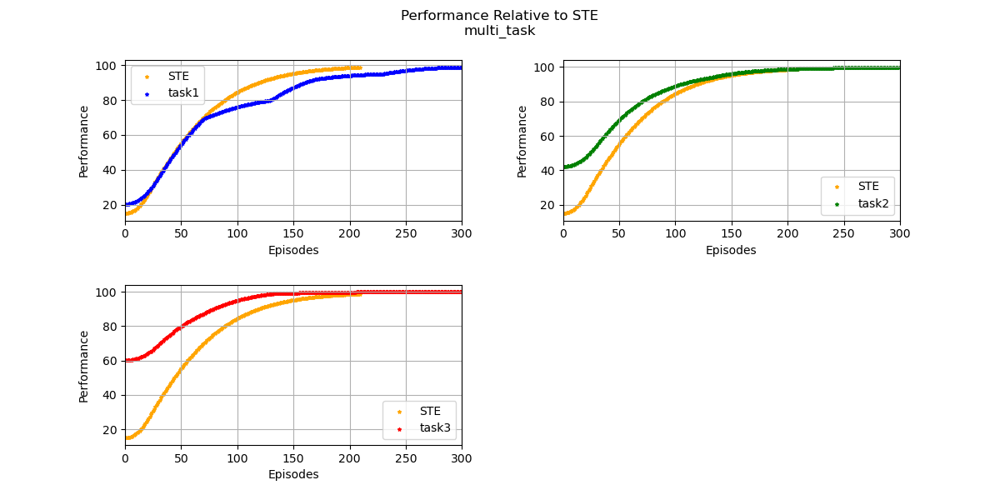

# Lifelong Learning Metrics (L2Metrics)

## Table of Contents

- [Introduction](#introduction)
- [Metrics](#metrics)
- [Getting Started](#getting-started)
  - [Prerequisites](#prerequisites)
  - [Installation](#installation)
- [Usage](#usage)
  - [Command-Line Execution](#command-line-execution)
  - [Storing Single-Task Expert Data](#storing-single-task-expert-data)
  - [Generating a Metrics Report](#generating-a-metrics-report)
  - [Custom Metrics](#custom-metrics)
- [License](#license)
- [Notes](#notes)

## Introduction

Lifelong Learning Metrics (L2Metrics) is a Python library containing foundational code for the L2M Metrics Framework. This framework includes the following:

- Python libraries for processing performance logs generated by lifelong learning algorithms
- Support for extending the framework with custom metrics

## Metrics

The L2Metrics library supports the following lifelong learning metrics as defined in the [Lifelong Learning Metrics for L2M specification version 0.66](https://github.com/darpa-l2m/shared_docs/blob/master/working_groups/metrics/metrics_specifications/Lifelong_Learning_Metrics_for_L2M.docx):

- Performance Recovery (PR)
- Performance Maintenance (PM)
- Forward Transfer (FT)
- Backward Transfer (BT)
- Performance Relative to a Single-Task Expert (RP)
- Sample Efficiency (SE)

## Evaluation

Refer to this [README](./evaluation/README.md) for information on the L2Metrics evaluation framework.

## Getting Started

L2Metrics is written in Python 3 and it is highly recommended to use at least version Python 3.6. The Metrics Framework has been tested on Windows 10 and Ubuntu 18.04/20.04. It should work on other platforms but has not been verified.

### Prerequisites

This library depends on the following main Python packages, also listed in [setup.py](setup.py):

- l2logger
- ipykernel
- ipympl
- matplotlib
- numpy
- pandas
- python-dateutil
- pytz
- scipy
- seaborn
- six
- tabulate
- tqd

### Installation

#### 1. Clone the L2Logger and L2Metrics repositories

```bash
git clone https://github.com/darpa-l2m/l2logger.git
git clone https://github.com/darpa-l2m/l2metrics.git
```

#### 2. (Optional) Create a Python virtual environment

```bash
python -m venv <path_to_new_venv>
```

Activate the virtual environment as follows:

Linux:

```bash
source <path_to_new_venv>/bin/activate
```

Windows:

```powershell
<path_to_new_venv>/Scripts/Activate.ps1
```

#### 3. Install the L2Logger and L2Metrics packages

```bash
pip install -e <path_to_l2logger>
pip install -e <path_to_l2metrics>
```

## Usage

To calculate metrics on the performance of your system, you must first generate log files in accordance with the L2Logger format version 1.0. Please refer to the L2Logger documentation for more details on how to generate compatible logs.

Once these logs are generated, you'll need to store Single-Task Expert (STE) data and pass the log directory as a command-line argument to compute STE-related metrics. Example log directories are provided to get you started. Additionally, an example `data_range.json` file is included to show how the user can specify task normalization ranges.

### Command-Line Execution

This section describes how to run L2Metrics from the command line. By default, the L2Metrics package will calculate metrics with the following options:

- Performance measure is "reward".
- Performance maintenance uses the most recent learning evaluation performance (`mrlep`) as opposed to the most recent terminal learning performance (`mrtlp`).
- Forward and backward transfer uses contrast.
- Smoothing is enabled via rectangular sliding window.
- Normalization is disabled.
- If enabled, default normalization is per-task using data within scenario.
- Outlier removal is disabled.
- Gaussian noise is disabled.
- Plotting is enabled.
- Results output is enabled.

```
usage: python -m l2metrics [-h] -l LOG_DIR [-s] [-p PERF_MEASURE]
                   [-m {mrtlp,mrlep,both}] [-t {contrast,ratio,both}]
                   [-n {task,run}] [-f DATA_RANGE_FILE] [--noise MEAN STD]
                   [-o OUTPUT] [--no-smoothing] [--normalize]
                   [--remove-outliers] [--no-plot] [--no-save]

Run L2Metrics from the command line

required arguments:
  -l LOG_DIR, --log-dir LOG_DIR
                        Log directory of scenario

optional arguments:
  -h, --help            show this help message and exit
  -s, --store-ste-data  Flag for storing log data as STE
  -p PERF_MEASURE, --perf-measure PERF_MEASURE
                        Name of column to use for metrics calculations
  -m {mrtlp,mrlep,both}, --maintenance-method {mrtlp,mrlep,both}
                        Method for computing performance maintenance
  -t {contrast,ratio,both}, --transfer-method {contrast,ratio,both}
                        Method for computing forward and backward transfer
  -n {task,run}, --normalization-method {task,run}
                        Method for normalizing data
  -f DATA_RANGE_FILE, --data-range-file DATA_RANGE_FILE
                        JSON file containing task performance ranges for
                        normalization
  --noise MEAN STD      Mean and standard deviation for Gaussian noise in log
                        data
  -o OUTPUT, --output OUTPUT
                        Specify output filename for plot and results
  --no-smoothing        Do not smooth data for metrics and plotting
  --normalize           Normalize data for metrics
  --remove-outliers     Remove outliers in data for metrics
  --no-plot             Do not plot performance
  --no-save             Do not save metrics outputs
```

**Note**: Valid values for the performance measure input argument are determined by the `metrics_columns` dictionary in `logger_info.json`.

### Storing Single-Task Expert Data

The following commands are examples of how to store STE data from the provided logs, run from the root L2Metrics directory:

```bash
python -m l2metrics -s -l examples/ste_task1
python -m l2metrics -s -l examples/ste_task2
python -m l2metrics -s -l examples/ste_task3
```

The specified log data will be stored in the `$L2DATA` directory under the `taskinfo` subdirectory, where all single-task expert data is pickled and saved. Storing STE data assumes the provided log only contains data for a single task/variant and only saves training data.

Replace the log directory with logs for other STE tasks and repeat until all STE data is stored.

### Generating Metrics Report

To generate a metrics plot and report, run the following command from the root L2Metrics directory:

```bash
python -m l2metrics -l examples/multi_task -p performance
```

If you do not wish to provide a fully qualified path to your log directory, you may copy it to your `$L2DATA/logs` directory. This is the default location for logs generated using the TEF.

The output figure of performance over episodes (saved by default) should look like this:


The white areas represent blocks in which learning is occurring while the gray areas represent evaluation blocks.

The framework should also produce a performance relative to STE plot shown below where the task performance curves are generated by concatenating all the training data from the scenario:



Additionally, the script will print the metrics report to the console and save the values to a TSV file by default. The following tables show an example of a metrics report output:

### Lifetime Metrics

| perf_recovery | perf_maintenance_mrlep | forward_transfer_contrast | backward_transfer_contrast | ste_rel_perf | sample_efficiency |
| ------------- | ---------------- | ---------------- | ----------------- | ------------ | ----------------- |
| 0.0           | -2.67            | 0.71             | -0.02             | 1.10         | 0.71              |

### Custom Metrics

See documentation in the examples folder at [examples/README.md](./examples/README.md) for more details on how to implement custom metrics.

## License

See [LICENSE](LICENSE) for license information.

## Notes

There are aspects of L2Metrics still under development including support for distributed training and testing/validation. This repository is being released to facilitate experimentation and feedback regarding the overall approach.
