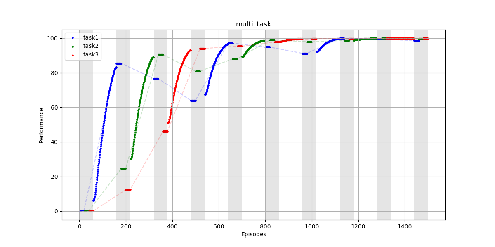
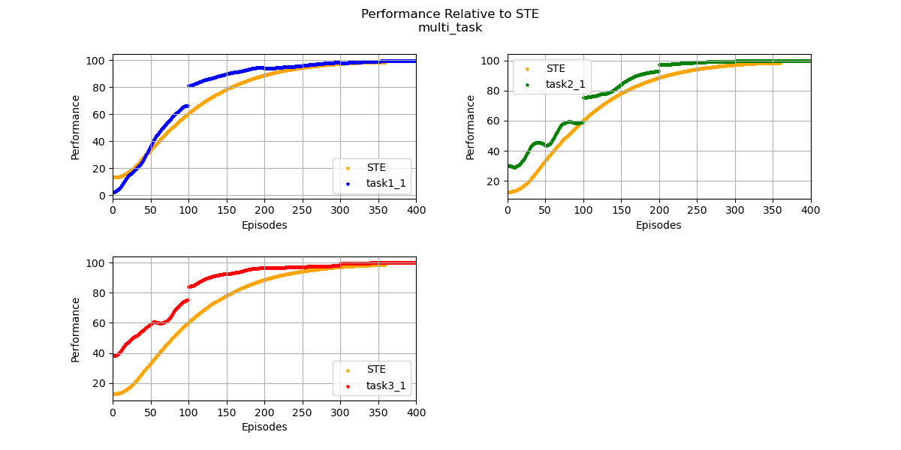

# Lifelong Learning Metrics (L2Metrics)

## Table of Contents

- [Introduction](#introduction)
- [Metrics](#metrics)
- [Evaluation](#evaluation)
- [Getting Started](#getting-started)
  - [Prerequisites](#prerequisites)
  - [Installation](#installation)
- [Usage](#usage)
  - [Command-Line Execution](#command-line-execution)
  - [Storing Single-Task Expert Data](#storing-single-task-expert-data)
  - [Generating a Metrics Report](#generating-metrics-report)
  - [Custom Metrics](#custom-metrics)
- [License](#license)
- [Notes](#notes)

## Introduction

Lifelong Learning Metrics (L2Metrics) is a Python library containing foundational code for the L2M Metrics Framework. This framework includes the following:

- Python libraries for processing performance logs generated by lifelong learning algorithms
- Support for extending the framework with custom metrics

## Metrics

The L2Metrics library supports the following lifelong learning metrics as defined in the [Lifelong Learning Metrics for L2M specification version 0.66](https://github.com/darpa-l2m/shared_docs/blob/master/working_groups/metrics/metrics_specifications/Lifelong_Learning_Metrics_for_L2M.docx):

- Performance Recovery (PR)
- Performance Maintenance (PM)
- Forward Transfer (FT)
- Backward Transfer (BT)
- Performance Relative to a Single-Task Expert (RP)
- Sample Efficiency (SE)

## Evaluation

Refer to this [README](./evaluation/README.md) for information on the L2Metrics evaluation framework.

## Getting Started

L2Metrics is written in Python 3 and it is highly recommended to use at least version Python 3.6. The Metrics Framework has been tested on Windows 10 and Ubuntu 18.04/20.04. It should work on other platforms but has not been verified.

### Prerequisites

This library depends on the following main Python packages, also listed in [setup.py](setup.py):

- l2logger
- ipykernel
- ipympl
- matplotlib
- numpy
- pandas
- pyarrow
- python-dateutil
- pytz
- scipy
- seaborn
- six
- tabulate
- tqdm

### Installation

#### 1. Clone the L2Logger and L2Metrics repositories

```bash
git clone https://github.com/darpa-l2m/l2logger.git
git clone https://github.com/darpa-l2m/l2metrics.git
```

#### 2. (Optional) Create a Python virtual environment

```bash
python -m venv <path_to_new_venv>
```

Activate the virtual environment as follows:

Linux:

```bash
source <path_to_new_venv>/bin/activate
```

Windows:

```powershell
<path_to_new_venv>/Scripts/Activate.ps1
```

#### 3. Install the L2Logger and L2Metrics packages

```bash
pip install -e <path_to_l2logger>
pip install -e <path_to_l2metrics>
```

## Usage

To calculate metrics on the performance of your system, you must first generate log files in accordance with the L2Logger format version 1.0. Please refer to the L2Logger documentation for more details on how to generate compatible logs.

Once these logs are generated, you'll need to store Single-Task Expert (STE) data and pass the log directories as command-line arguments to compute STE-related metrics. Several example files are included to get you started:

- Example STE and LL log directories:
  - `./examples/ste_task1/`
  - `./examples/ste_task2/`
  - `./examples/ste_task3/`
  - `./examples/multi_task/`
- Example `config.json` file for setting command-line arguments
- Example `data_range.json` file to show how the user can specify task normalization ranges

### Command-Line Execution

This section describes how to run L2Metrics from the command line.

```
usage: python -m l2metrics [-h] [-l LOG_DIR] [-s {w,a}] [-v {time,metrics}]
                   [-p PERF_MEASURE] [-a {mean,median}]
                   [-m {mrtlp,mrlep,both}] [-t {contrast,ratio,both}]
                   [-n {none,task,run}]
                   [-g {none,flat,hanning,hamming,bartlett,blackman}]
                   [-w WINDOW_LENGTH] [-x] [-d DATA_RANGE_FILE] [-N MEAN STD]
                   [-o OUTPUT] [-r] [-e] [--no-show-eval-lines] [-P]
                   [--no-plot] [-S] [--no-save] [-c LOAD_CONFIG] [-C]
                   [--no-save-config]

Run L2Metrics from the command line

optional arguments:
  -h, --help            show this help message and exit
  -l LOG_DIR, --log-dir LOG_DIR
                        Log directory of scenario
  -s {w,a}, --ste-store-mode {w,a}
                        Mode for storing log data as STE, overwrite (w) or
                        append (a)
  -v {time,metrics}, --ste-averaging-method {time,metrics}
                        Method for handling STE runs, time-series averaging
                        (time) or LL metric averaging (metric)
  -p PERF_MEASURE, --perf-measure PERF_MEASURE
                        Name of column to use for metrics calculations
  -a {mean,median}, --aggregation-method {mean,median}
                        Method for aggregating within-lifetime metrics
  -m {mrtlp,mrlep,both}, --maintenance-method {mrtlp,mrlep,both}
                        Method for computing performance maintenance
  -t {contrast,ratio,both}, --transfer-method {contrast,ratio,both}
                        Method for computing forward and backward transfer
  -n {none,task,run}, --normalization-method {none,task,run}
                        Method for normalizing data
  -g {none,flat,hanning,hamming,bartlett,blackman}, --smoothing-method {none,flat,hanning,hamming,bartlett,blackman}
                        Method for smoothing data, window type
  -w WINDOW_LENGTH, --window-length WINDOW_LENGTH
                        Window length for smoothing data
  -x, --remove-outliers
                        Remove outliers in data for metrics
  -d DATA_RANGE_FILE, --data-range-file DATA_RANGE_FILE
                        JSON file containing task performance ranges for
                        normalization
  -N MEAN STD, --noise MEAN STD
                        Mean and standard deviation for Gaussian noise in log
                        data
  -o OUTPUT, --output OUTPUT
                        Specify output filename for plot and results
  -r, --show-raw-data   Show raw data points under smoothed data for plotting
  -e, --show-eval-lines
                        Show lines between evaluation blocks
  --no-show-eval-lines  Do not show lines between evaluation blocks
  -P, --do-plot         Plot performance
  --no-plot             Do not plot performance
  -S, --do-save         Save metrics outputs
  --no-save             Do not save metrics outputs
  -c LOAD_CONFIG, --load-config LOAD_CONFIG
                        Load L2Metrics settings from JSON file
  -C, --do-save-config  Save L2Metrics settings to JSON file
  --no-save-config      Do not save L2Metrics settings to JSON file
```

By default, the L2Metrics package will calculate metrics with the following options:

- STE averaging method is `time`, which averages the time-series training data across STE logs for relative performance and sample efficiency calculations.
- Performance measure is `reward`.
- Aggregation method is `median`, which reports the lifetime metrics as the median of task-level metrics as opposed to mean.
- Performance maintenance method is `mrlep`, which uses the most recent learning evaluation performance as opposed to the most recent terminal learning performance (`mrtlp`).
- Forward and backward transfer use `contrast`.
- Normalization method is `task`, which computes the per-task data ranges by looking at LL and STE log data, then normalizing to [0, 100].
- Smoothing method is `flat`, which is smooths data with a rectangular sliding window.
- Smoothing window length is `None`, which defaults to min(int(`block_length` * 0.2), 100).
- Outlier removal is disabled. When enabled, the outliers (detected using 0.1, 0.9 quantiles) will be clamped to the quantile bounds.
- Gaussian noise is disabled.
- Plotting is enabled.
- Draw lines between evaluation blocks is enabled.
- Saving of results and log data is enabled.
- Saving of configuration settings is enabled.

**Note**: Valid values for the performance measure input argument are determined by the `metrics_columns` dictionary in `logger_info.json`.

### Storing Single-Task Expert Data

The following commands are examples of how to store STE data from the provided logs, run from the root L2Metrics directory:

```bash
python -m l2metrics -l examples/ste_task1 -s w
python -m l2metrics -l examples/ste_task2 -s w
python -m l2metrics -l examples/ste_task3 -s w
```

The specified log data will be stored in the `$L2DATA` directory under the `taskinfo` subdirectory, where all single-task expert data is pickled and saved. The STE store mode specified in the example commands is `w`, which is "write" or "overwrite." This mode will create a new pickle file for the STE if one does not already exist; if there is already a file for the same task in the `taskinfo` location, it will be overwritten in this mode. The append mode, `a`, can be used to store multiple runs of STE data in the same pickle file. Then, the STE averaging method can be selected in the `l2metrics` module to modify how multiple STE runs are handled. Storing STE data assumes the provided log only contains data for a single task/variant.

Replace the log directory argument with logs for other STE tasks and repeat until all STE data is stored.

### Generating Metrics Report

To generate a metrics plot and report, run the following command from the root L2Metrics directory:

```bash
python -m l2metrics -l examples/multi_task -p performance
```

If you do not wish to provide a fully qualified path to your log directory, you may copy it to your `$L2DATA/logs` directory. This is the default location for logs generated using the TEF.

The default outputs of the above command are:

- `multi_task_data.feather`: The log data DataFrame containing raw and pre-processed data.
- `multi_task_config.json`: The configurations used to generate the metrics report.
- `multi_task_metrics.json`: The lifetime and task-level metrics of the run.
- `multi_task.png`: The sawtooth plot.
- `multi_task_ste.png`: The performance relative to STE plot.

The output figure of performance over episodes should look like this:



The white areas represent blocks in which learning is occurring while the gray areas represent evaluation blocks. **Note**: The performance values shown in the evaluation blocks are an average over the whole block, resulting in a flat line for each task.

The framework should also produce a performance relative to STE plot shown below, where the task performance curves are generated by concatenating all the training data from the scenario:



Additionally, the script will print the metrics report to the console and save the values to a JSON file by default. The following table shows an example of a metrics report output:

### Lifetime Metrics

| perf_recovery | perf_maintenance_mrlep | forward_transfer_contrast | backward_transfer_contrast | ste_rel_perf | sample_efficiency |
| ------------- | ---------------------- | ------------------------- | -------------------------- | ------------ | ----------------- |
| 0.0           | -2.74                  | 1.00                      | -0.02                      | 1.11         | 0.71              |

### Custom Metrics

See documentation in the examples folder at [examples/README.md](./examples/README.md) for more details on how to implement custom metrics.

## License

See [LICENSE](LICENSE) for license information.

## Notes

There are aspects of L2Metrics still under development including support for distributed training and testing/validation. This repository is being released to facilitate experimentation and feedback regarding the overall approach.
