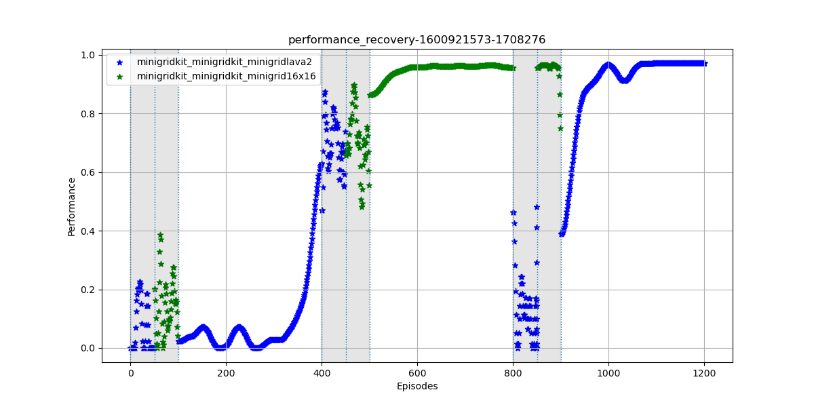
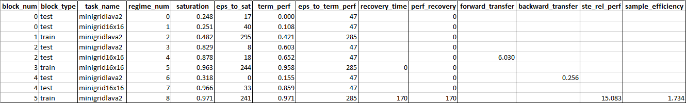

# Lifelong Learning Metrics (L2Metrics)

## Table of Contents

* [Introduction](#introduction)
* [Metrics](#metrics)
* [Getting Started](#getting-started)
  * [Prerequisites](#prerequisites)
  * [Installation](#installation)
* [Usage](#usage)
  * [Command-Line Execution](#command-line-execution)
  * [Storing Single Task Expert Data](#storing-single-task-expert-data)
  * [Generating a Metrics Report](#generating-a-metrics-report)
  * [Custom Metrics](#custom-metrics)
* [License](#license)
* [Notes](#notes)

## Introduction

Lifelong Learning Metrics (L2Metrics) is a Python library containing foundational code for the L2M metrics framework. This framework includes the following:

* Python libraries for processing performance logs generated by lifelong learning algorithms
* Support for extending the framework with custom metrics

## Metrics

The L2Metrics library supports the following lifelong learning metrics as defined in the Lifelong Learning Metrics for DARPA L2M version 0.63:

* Performance Recovery (PR)
* Performance Maintenance (PM)
* Forward Transfer (FT)
* Backward Transfer (BT)
* Performance Relative to a Single Task Expert (RP)
* Sample Efficiency (SE)

## Getting Started

L2Metrics is written in Python 3. It is recommended to use at least version Python 3.6.

### Prerequisites

This library depends on the following main Python packages, also listed in [setup.py](setup.py):

* numpy
* pandas
* tabulate
* scipy
* matplotlib

### Installation

#### 1. Clone the repo

  ```bash
  git clone https://github.com/darpa-l2m/l2metrics.git
  ```

#### 2. (Optional) Create a Python virtual environment

```bash
python -m venv <path_to_new_venv>
```

Activate the virtual environment as follows:

Linux:

```bash
source <path_to_new_venv>/bin/activate
```

Windows:

```powershell
<path_to_new_venv>/Scripts/Activate.ps1
```

#### 3. Install the L2Metrics package

```bash
pip install -e <path_to_l2metrics>
```

## Usage

To calculate metrics on the performance of your system, you must first generate log files in accordance with the L2Logger format. Please refer to the L2Logger documentation for more details on how to generate compatible logs.

Once these logs are generated, you'll need to store Single Task Expert (STE) data and pass the log directory as well as the performance measurement to run the metrics. Example log directories are provided to get you started.

### Command-Line Execution

  ```
  usage: l2metrics [-h] -l LOG_DIR [-s] [-p PERF_MEASURE] [-o OUTPUT]
                   [--no-plot] [--no-save]
  
  Run L2Metrics from the command line

  required arguments:

    -l LOG_DIR --log-dir LOG_DIR
                          Log directory of scenario

  optional arguments:

    -s, --store-ste-data  Flag for storing log data as STE
    -p PERF_MEASURE, --perf-measure PERF_MEASURE
                          Name of column to use for metrics calculations
    -o OUTPUT, --output OUTPUT
                          Specify output filename for plot and results
    --no-plot             Do not plot performance
    --no-save             Do not save metrics outputs
```

### Storing Single Task Expert Data

To store STE data, run the following command from the root L2Metrics directory:

```bash
python -m l2metrics -s -l examples/ste_example/ste_syllabus-1600921217-488978 -p reward
```

The specified log data will be stored in the `$L2DATA` directory under the `taskinfo` subdirectory, where all single task expert data is pickled and saved. Storing STE data assumes the provided log only contains data for a single task and only saves training data.

Replace the log directory with logs for other STE tasks and repeat until all STE data is stored.

### Generating Metrics Report

To generate a metrics plot and report, run the following command from the root L2Metrics directory:

```bash
python -m l2metrics -l examples/perf_recovery_example/performance_recovery-1600921573-1708276 -p reward
```

If you do not wish to provide a fully qualified path to your log directory, you may copy it to your `$L2DATA/logs` directory. This is the default location for logs generated using the TEF.

The output figure of reward over episodes (saved by default) should look like this:



The white areas represent blocks in which learning is occurring while the gray areas represent evaluation blocks.

Additionally, the script will print the metrics report to the console and save the values to a TSV file by default. The following figure shows an example of a truncated metrics report:



**Note**: Currently there are metrics that are filled in every row and some that are not. This is a result of different contexts for the calculated metric. For example, each regime will have its own saturation and terminal performance values (regime-level metrics) while each task will have associated performance maintenance, forward/backward transfer, relative performance to STE, and sample efficiency values (task-level). Additionally, performance recovery will only have one value for the entire scenario (scenario-level). The format of the metrics report is still a work in progress and will be cleaned up in the future to more clearly convey results.

### Custom Metrics

See documentation in the examples folder at [examples/README.md](./examples/README.md) for more details on how to implement custom metrics.

## License

See [LICENSE](LICENSE) for license information.

## Notes

There are aspects of L2Metrics still under development including support for distributed training and testing/validation. This repository is being released to faciliate experimentation and feedback regarding the overall approach.
