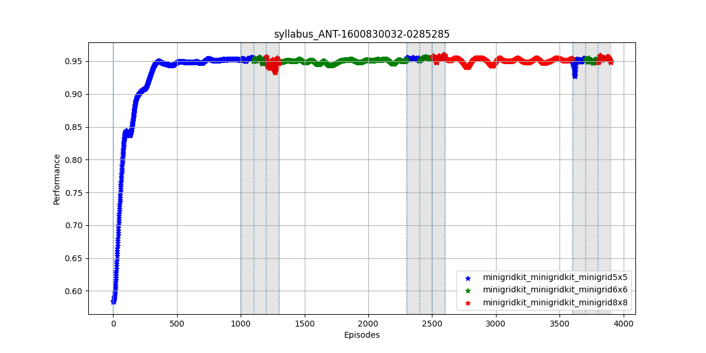

# Getting Started with Lifelong Learning Metrics (L2Metrics)

This directory contains two Python files:

* `store_ste_data.py`:
  * A script for storing single task expert log data used by a few of the metric calculations

  ```bash
  usage: store_ste_data.py [-h] [-l LOG_DIR] [-p PERF_MEASURE]
  
  Store single task expert data from the command line

  required arguments:

    -l  --log_dir       Log directory of scenario

  optional arguments:

    -p  --perf_measure  Name of column to use for metrics calculations

  ```

* `calc_metrics.py`:
  * The main script for calculating lifelong learning metrics, plotting, and generating a metrics report

  ```bash
  usage: store_ste_data.py [-h] [-l LOG_DIR] [-p PERF_MEASURE]
  
  Run L2Metrics from the command line

  required arguments:

    -l  --log_dir       Log directory of scenario

  optional arguments:

    -p  --perf_measure  Name of column to use for metrics calculations

  ```

## Example Usage

### Storing STE Data

To store STE data, run the following command from the root L2Metrics directory:

```bash
python examples/store_ste_data.py --log_dir=examples/ste_syllabus-1600829944-8467104
```

The specified log data will be stored in the `$L2DATA` directory under the `taskinfo` subdirectory, where all single task expert data is pickled and saved.

Replace the log directory with logs for other STE tasks and repeat until all STE data is stored.

### Generating Metrics Report

To generate a metrics plot and report, run the following command from the root L2Metrics directory:

```bash
python examples/calc_metrics.py --log_dir=examples/syllabus_ANT-1600830032-0285285 --perf_measure=reward
```

If you do not wish to provide a fully qualified path to your log directory, you may copy it to your `$L2DATA/logs` directory. This is the default location for logs generated using the TEF.

The output figure of reward over episodes (saved by default) should look like this:



The white areas represent blocks in which learning is occurring while the gray areas represent evaluation blocks.

Additionally, the script will print the metrics report to the console and save the values to a TSV file by default. The following figure shows an example of a truncated metrics report:


## Writing a Custom Metric

The file `calc_metrics.py` demonstrates how to add custom metrics to a metrics report. Data from the logs is provided to the calculate method, where the actual calculation of your metric should live. An example of an agent metric, max value, is provided for your edificiation. To add this metric to the default metrics calculated for a Metrics Report, simply invoke the following command:

```Python
metrics_report.add(MyCustomAgentMetric(perf_measure))
```

and it will be added to the end of the list in addition to the defaults.

The custom metric class should have a method with the following name and inputs:

```Python
calculate(self, dataframe, block_info, metrics_dict):
```

Inputs:

* :param dataframe: Pandas dataframe of log data collated from log files
* :param block_info: Pandas dataframe with high-level information about blocks extracted from log data; contains no reward/score columns
* :param metrics_df: Pandas dataframe with columns corresponding to calculated metrics along with some of the block_info information. Prints out at the end for reporting

Output:

* :return: metrics_df: Pandas dataframe, updated with columns corresponding to previously calculated metrics

## A few important notes

1. The calculate methods for each metric in self._metrics are called **in the order they were added**. Thus, you may choose to leverage previously calculated metrics for your subsequent calculations.
2. "NaN" is the default value in the metrics_df for blocks which do not receive a value.
3. To avoid adding your computed metric to the metrics_df, simply do not include the call to _localutil.fill_metrics_df, which takes the values you pass and returns a dataframe with those values.
